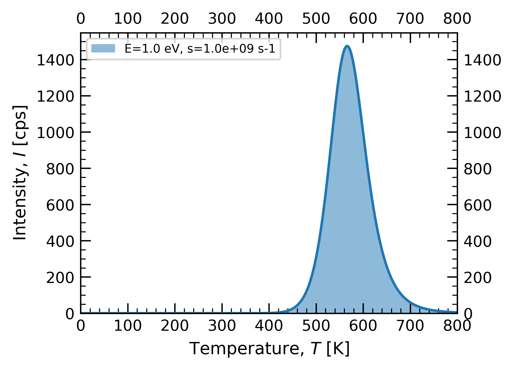
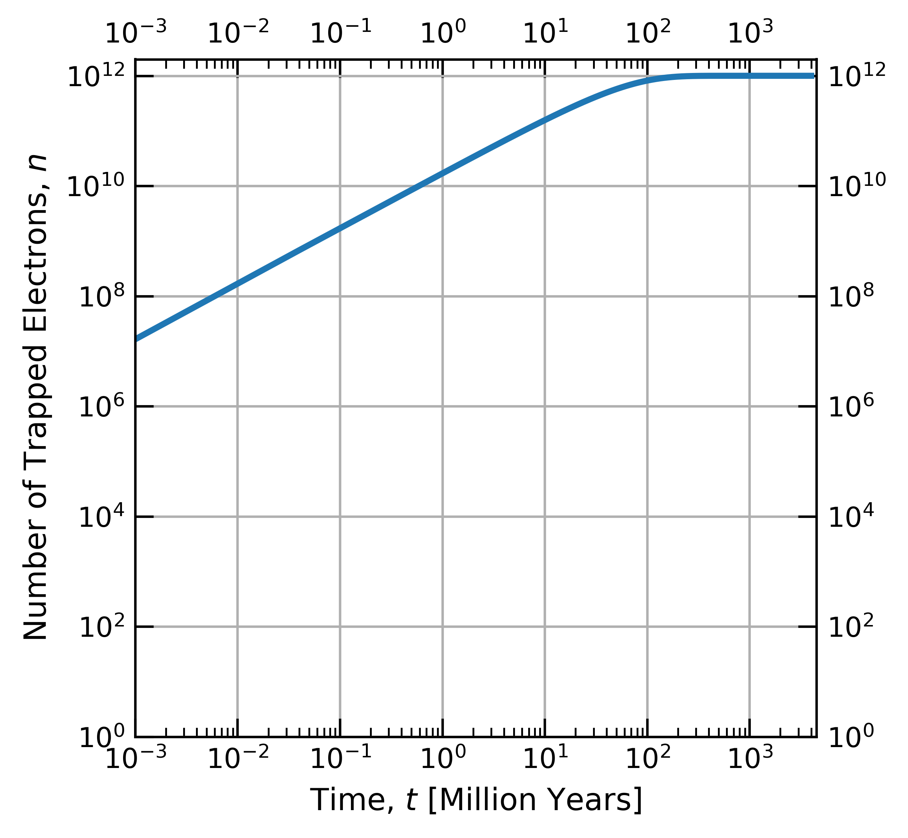

# Thermoluminescence Calculations

We provide tools to conveniently calculate the thermoluminescence (TL) peak and the timescale needed for a given TL peak to reach equilibrium. Our repository includes two main scripts and a Jupyter Notebook for these purposes.

## Scripts

### 1. TL_2ndOrderKineticsPeak.py

This script calculates the TL intensity as a function of the glow curve temperature using second-order kinetics.

Usage
```
python TL_2ndOrderKineticsPeak.py
```

The figure below shows the an example output using an E value of 1.00 eV and s of 1E9 s-1. The calculations are also saved in a seperate .csv file for each calculation.



### 2. TL_EquilibrationTime.py
This script calculates the build-up of TL over time based on selected kinetic parameters.

Usage:
```
python TL_EquilibrationTime.py
```

The figure below shows the calculation depending on the parameters used. In this case, the plateau indicates that electrons traps become fully saturated at around 200 Million years.




## Jupyter Notebook
We also provide a Jupyter Notebook, 'Thermoluminescence_Calculations.ipynb', which includes additional background documentation.

## Output
All scripts output:

* An image file representing the calculated TL data.
* A CSV file containing the accompanying data, stored in the calculations subfolder.

## Installation and Dependencies
To run these scripts, ensure you have Python installed along with the required dependencies. You can install the necessary packages using:

```
pip install -r requirements.txt
```

## Contribution
We welcome contributions to improve and expand the functionality of these tools. Please feel free to fork the repository and submit pull requests.

## License
This project is licensed under the Creative Commons Attribution 4.0 (CC-BY-4.0).

## Contact
For any questions or further information, please contact us at alexander.sehke@nasa.gov.

